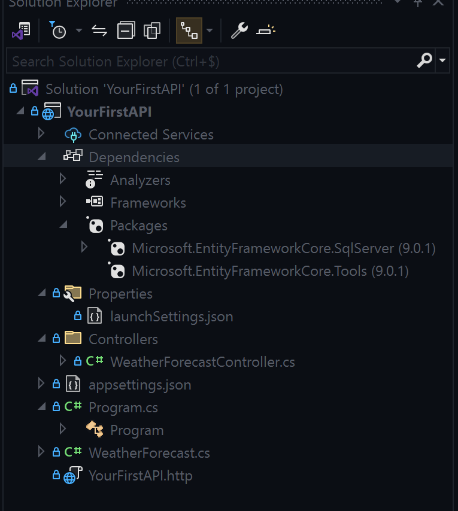

# 18.ASP.NET : Introduction

The aim of this course is to train you in the asp.net environment:

ASP.NET is an open source web framework, created by Microsoft, for building modern applications and web services that run on macOS, Linux, Windows and Docker.

## 1. Where do we start? 
Once you've seen the basics of C# and the advanced part, you're ready to start developing with the ASP.net framework.

Here's a summary of what you can do with this framework. Let's take a closer look:

As you can see, ASP.net offers a wide range of tools. In fact, sites (or APIs) can be designed using the MVC (Model-View-Controller) aborescence. We can create web pages with “Razor Pages” and even dynamic pages with “Blazor”.

We can also create cross-platform “Mobile Applications” (.NET MAUI) and desktop applications with “.net WPF”.

In short, there's a lot you can do with this framework.

## 2. You don't answer the question.
First, let's take a look at API creation. The reason is simple: you have to start somewhere. 

We've opted for API creation, and then for Angular. In fact, there are quite a few job offers, and it's a good combination. 

However, some of you may want to go into sites creation (with Razor Pages) or move into mobile applications or desktops. But it will be possible during the last month.

To conclude this point, as you can see, the framework shares common services, middleware and extensions. 

### 3. Where to start?
- 1.In a new solution (or an existing one), create a new “ASP.NET Core Web API” project.

- 2.2. In the project's “Packages” folder, manage the NuGet packages and install these two dependencies:
    - **Microsoft.EntityFrameworkCore.SqlServer**
    - **Microsoft.EntityFrameworkCore.Tools**

- **Microsoft.EntityFrameworkCore.SqlServer**:
This is a provider package for Entity Framework Core (EF Core) that enables your application to interact with Microsoft SQL Server databases. It provides the necessary database-specific functionality and optimizations, allowing EF Core to generate SQL queries tailored for SQL Server.

- **Microsoft.EntityFrameworkCore.Tools**:
This package provides command-line tools for managing EF Core migrations and database updates. It allows you to use commands like dotnet ef migrations add and dotnet ef database update to create and apply database migrations, helping you manage schema changes efficiently.

Now you are ready for the next step!

---

